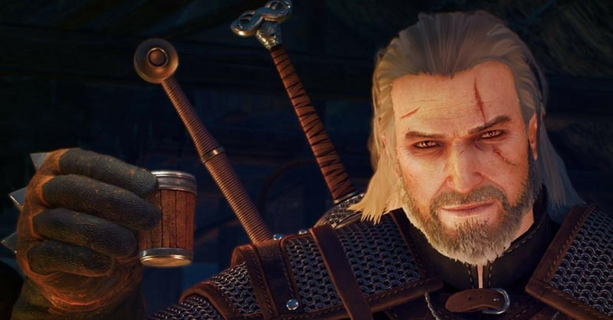

Кто такой Геральт?
Геральт из Ривии родился в 1212 году — главный герой литературного цикла «Ведьмак», ведьмак, охотник на монстров, белый волк

Почему Геральт, вы не задумывались?

Имя дала ему его мать чародейка-целительница.однако сам он большую часть жизни полагал, что получил его от своего наставника — Весемира. В беседе или при знакомстве Геральт предпочитает представляться коротко: «Геральт из Ривии».

Давайте вспомним как Геральт выглядел в первой части игры.

В первой части игры, мы видем ещё молодое лицо и шрам на правой полоцине лица Геральт упоминает, что этот шрам ему нанёс куролиск из Спаллы, вероятно, в период преследования им Дикой Охоты в 1269 году.

Давайте вспомним с чего всё начиналось.

В первой части игры Геральта находят непадолёку от крепости Каэр Морхена,после магической бури.На протяжении всей игры он выполняет разные задания,спасает людей от монстрой и в конце игры он приносит украденные секреты ведьмаков Фольтесту. По пути из замка он обнаруживает убитую стражу, бежит в троный зал вступает в схватку с таинственным убийцей.Он одерживает вверх, отрубает убийце руку и обнаруживает что это ведьмак.

Ведьмак 2

На протяжении всей игры он ищет Лето(Это человек который убил короля Фольтеста). После того как Ведьмак с королём спаслись от чудовища, они спрятались в башне где король встретился со всеми детьми, а рядом стоит слепой священник.Тут Волк совершает ужасную ошибку: он отворачивается, давая возможность священнику убить короля. Геральт не успевает спасти Фольтеста, а в башню прибывают солдаты. Король валяется в луже крови, рядом стоит Ведьмак — путь в темницу обеспечен. В конце игры он находит Лето и решает убить его.

Ведьмак 3

С самого начала игры всё спокойно, ничего не предвещало беды Ведьмак тренирует Цири. Но через некоторое время когда она подростёт на них нападает Дикая Охота.Девочке удаётся спастись и она на протяжении всей игры убегает от них.А Геральт на протяжении всей игры пытается её найти.В конце игры он её находит но она уходит в битву с Дикой Охотой и уже не возвращается.